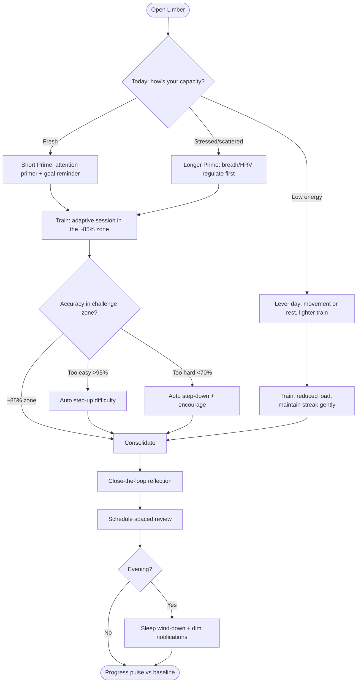
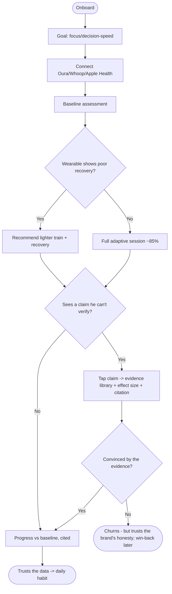
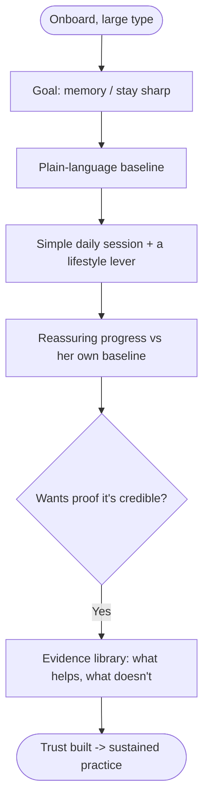
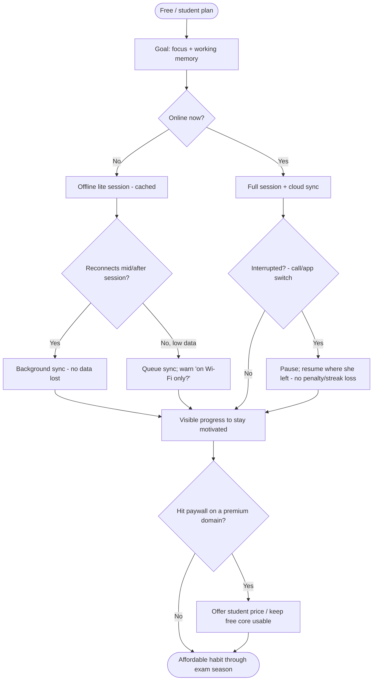
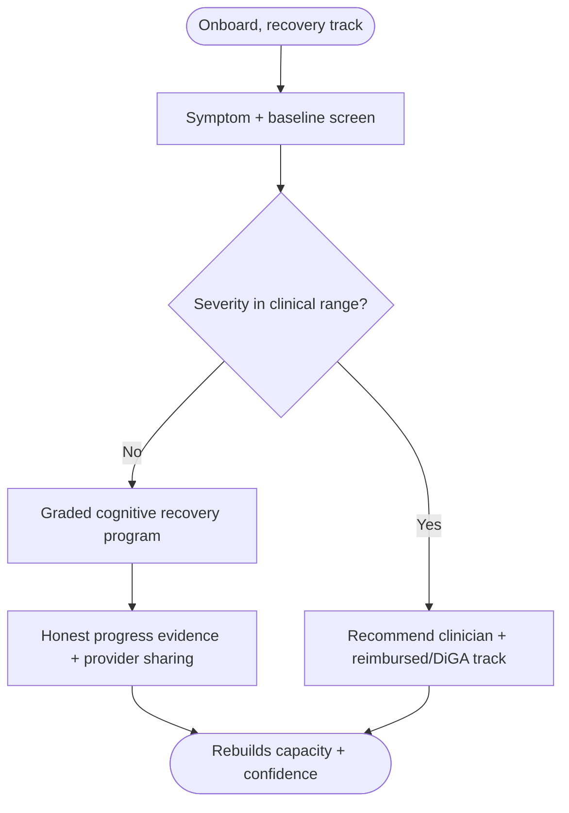
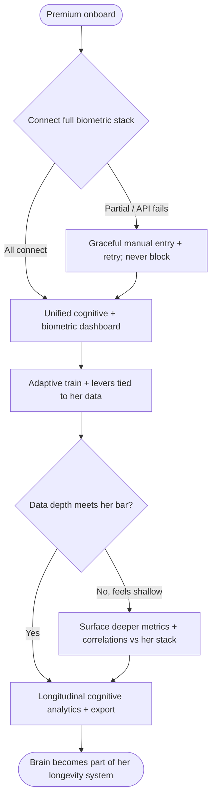
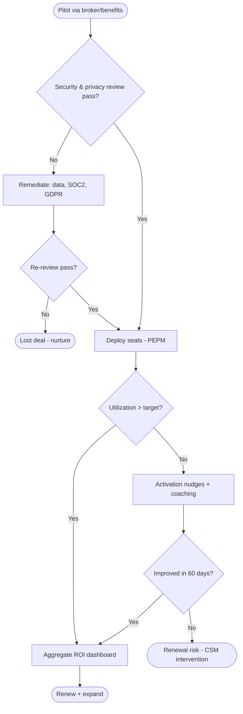
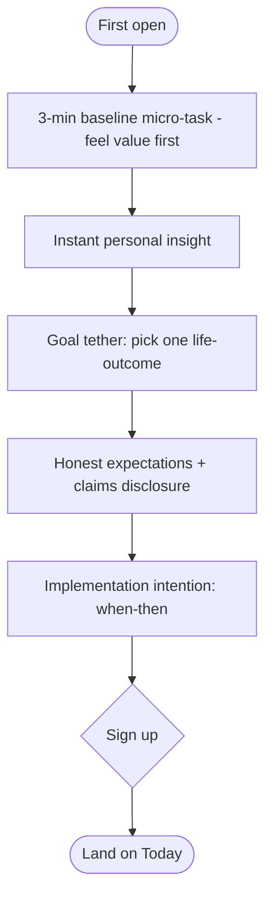

# Information Architecture & User Flows — Limber (Global)
### Sitemap + decision-based task flows for all personas · June 2026
> Built on the neuroplasticity core (**Prime → Train → Consolidate**) and the Kleim & Jones principles. Every flow has a clear entry point, decision points (branching on segment/goal/state/score), and a successful outcome — each annotated with cited evidence. Mermaid format. Covers all personas (Excellent-rubric requirement).

## 1. Information Architecture (Sitemap)

```mermaid
graph TD
    A[Limber] --> B[Onboarding]
    A --> C[Today]
    A --> D[Prime]
    A --> E[Train]
    A --> F[Consolidate]
    A --> G[Progress]
    A --> H[Levers]
    A --> I[Evidence]
    A --> J[Me / Settings]

    B --> B1[Goal tether: focus / memory / mood / longevity / recovery]
    B --> B2[Baseline assessment 5-7 min]
    B --> B3[Personalize: variability, wearables, schedule]
    B --> B4[Honest expectations + claims disclosure]

    C --> C1[One priority signal + today's session]
    D --> D1[Regulate: breath / HRV]
    D --> D2[Attention primer + goal reminder]
    E --> E1[Adaptive training in the ~85% zone]
    E --> E2[Novelty rotation by domain]
    E --> E3[Difficulty zone meter]
    F --> F1[Close-the-loop reflection]
    F --> F2[Spaced-review schedule]
    F --> F3[Sleep support + wind-down]
    G --> G1[30-day trend vs personal baseline]
    G --> G2[Domain radar: attention/memory/speed/flexibility]
    G --> G3[Re-assessment every 4 weeks]
    H --> H1[Move / Exercise nudge -> BDNF]
    H --> H2[Sleep tracking + hygiene]
    H --> H3[Stress regulation]
    I --> I1[What the science shows / doesn't]
    I --> I2[Citations per feature]
    J --> J1[Wearable & data integrations]
    J --> J2[Accessibility: dyslexia/ADHD/contrast/motion]
    J --> J3[Subscription / privacy / data export]
```

**IA design decisions & evidence:** Prime/Train/Consolidate as top-level nodes (the plasticity recipe); **Levers** elevated to first-class (exercise/sleep/stress gate plasticity — Strong); **Evidence** is a first-class node (transparency = the trust moat, anti-Lumosity); **Progress** uses personal baseline not leaderboards (credibility + anti-anxiety, UX research).

**Navigation mechanics (hierarchy & states):**
- **Persistent bottom nav (4 primary destinations):** Today · Progress · Levers · Me — always one tap away.
- **Today is the launchpad:** Prime → Train → Consolidate are a *linear session flow* reached from Today (not bottom-nav items), with a step ribbon showing position.
- **Drill-down (secondary):** Evidence library (from Today/Me), Onboarding (first-run only), Clinical-handoff overlay (surfaced contextually on a clinical-range score, over any screen), Settings/integrations/accessibility (under Me).
- **Global states per screen:** loading skeleton → content; empty ("no sessions yet → start your baseline"); offline (cached core usable, sync badge); error (retry, never a dead end). Notifications suspended mid-session.

## 2. Master daily flow (state/goal-adaptive)

**Evidence per decision:** adaptive difficulty held at ~85% (validated challenge zone — Strong); auto step-up/down keeps the user in the plasticity-inducing zone (Boyd: difficulty drives structural change); spaced review + sleep = consolidation (Strong); lever/rest day respects state (stress closes the window).

## 3. Persona-specific task flows (all personas)
### 3a. Optimizer Ryo — rigor + integration (with skepticism/churn branch)

*Evidence:* biometric integration informs load (poor recovery → lighter session, Strong); the **skepticism branch** directly answers Ryo's documented pain ("the second an app overclaims, I'm out") — every claim is one tap from its evidence; honest churn (no dark-pattern retention) preserves brand trust for win-back.

### 3b. Worried-Well Margaret — credibility + simplicity

*Evidence:* clinical-credibility cues; no leaderboards (anti-anxiety); lifestyle levers framed as doctor-aligned.

### 3c. Student Priya — affordable, offline, focus (full edge-case handling)

*Evidence:* offline/lite (<150KB/screen on 3G); sync-failure & low-data branches (global connectivity reality); interrupt-resume with no streak penalty (ethical engagement); student pricing keeps the free core usable; attention/WM training; localization.

### 3d. Recovery James — validated, graded, reimbursable

*Evidence:* clinical credibility; graded difficulty; progress evidence; DiGA/clinical + reimbursement path.

### 3e. Longevity Elena — integrated systems (with integration-failure & depth branches)

*Evidence:* Elena's documented pain is **siloed, shallow tools** — so the flow branches on integration failure (graceful fallback, never a dead end) and on perceived data-depth (escalate to deeper metrics/correlations + export), directly serving her "if I can't measure it, I can't manage it" mindset and high WTP for depth.

### 3f. Buyer Dana — B2B purchase + activation (with failure paths)

## 4. Onboarding flow (value before signup)

*Evidence:* value-before-signup (Duolingo pattern); goal tether (salience = biological lever); implementation intention (3.2× maintenance); honest disclosure (anti-overclaim).

## ✅ Excellent-criteria self-review (User Flow rubric, /10)
All personas covered (5 user + buyer + master + onboarding); decisions branch on segment/goal/state/accuracy-zone/clinical-score; clear start/end + decision diamonds; B2B failure paths modelled; every decision annotated with cited neuroscience/UX evidence.
